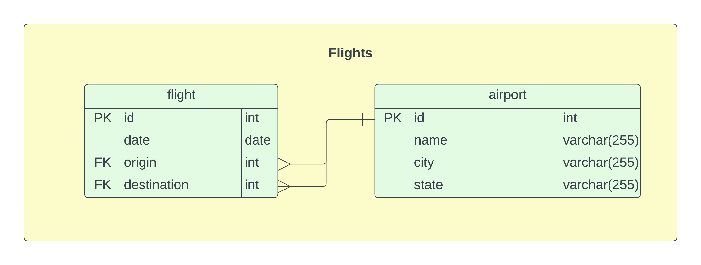

# PyDestinationsUS

*\*\*TODO: Add db config options.*

A simple ETL project inspired from the original [DestinationsUS](https://github.com/jxandercrawford/DestinationsUS). This is an implmentation is Python.

This pipeline will pull data from the [Bureau of Transportation Statistics](https://transtats.bts.gov) and load them into a PostgreSQL database. The schema for the database is shown below.



The conda enviroment for this project can be found in [/resouces/enviroment/enviroment.yml](/resources/enviroment/environment.yml). Please create thie enviroment before running with `conda env create -f environment. yml`. Then activate it with `conda activate destinations`. For more information on conda enviroments please visit [conda's documentation](https://conda.io/projects/conda/en/latest/user-guide/tasks/manage-environments.html).

### Usage
```bash
usage: run.py [-h] -y YEAR -m MONTH [-n NUMBER] [-s SERVERHOST] [-d DATABASE] [-u USER] [-p PASSWORD]

Run the Bereau of Transporation Statistics flight data pipeline.

options:
  -h, --help            show this help message and exit
  -y YEAR, --year YEAR  The year to target as an integer.
  -m MONTH, --month MONTH
                        The year to target as an integer.
  -n NUMBER, --number NUMBER
                        Optional, the number of months to ingest as an integer starting from the year and month and increasing by 1 month. Must be greater than 0.
  -s SERVERHOST, --serverhost SERVERHOST
                        Optional, the database host server.
  -d DATABASE, --database DATABASE
                        Optional, the database name.
  -u USER, --user USER  Optional, the database username.
  -p PASSWORD, --password PASSWORD
                        Optional, the database user password.
```
